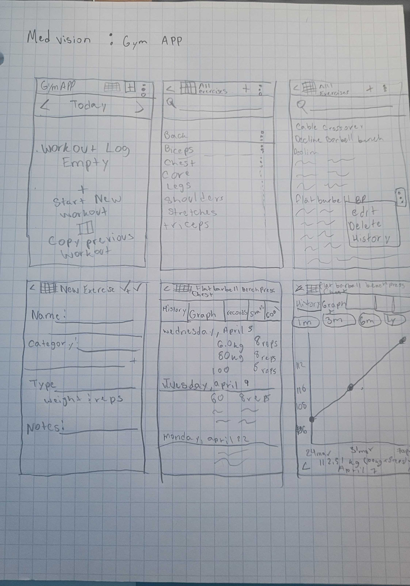

# Android-Fitness

# Milestone 1

## Table of Contents

1. [Overview](#Overview)
1. [Product Spec](#Product-Spec)
1. [Wireframes](#Wireframes)

### Team Members
- Angel (Pikachu)
- Brandon
- [Magfur Jafory](https://github.com/mjafory)
- Erik

## Brainstorm

[Meeting notes](./MEETING.md)

### Brandon
- Gym Routine Tracking App
- Medication Tracking App
- Diet Tracking App

#### Magfur
- Gym App

#### Erik
- Online Group Chatting
- Running app
- Weather app

#### Angel L Garcia
- 4chan android client
- Shitpost app
- Trolley Location System

## 2.1 TOP THREE
- Gym Routine Tracking App
- Trolley Location System
- Online Group Chatting

## 2.2 Evaluating Ideas

#### Online Group Chatting
- Mobile
    - Quick and easy communication
    - Video Call communication, Voice Call, Real-time Messaging
- Story
    - Very clear for communication with others
    - Will be helpful for group communication as well
- Market
    - The Potential user base would be anyone with a phone looking to find a way to communicate with others
    - This would be a free app so anyone is able to download and access the app
- Habit
    - Users would use this app daily to access DMs from others
    - They are able to both create group chats and new messages with other users
- Scope
    - This would be a good challenged to complete the app
    - We need to be able to create logins for each user and store that into a database to saver their info and messages

### Gym Routine Tracking App
- Mobile
    - Convenient for Progress tracking over a notebook
    - Can keep large volumes of data points spanning multiple time points with high fidelity
- Story
    - Good for fitness tracking and progress over time
    - helpful for integration into a a larger medical platform for holistic data analytics
- Market
    - Gym goers and anyone interested in tracking their health over time
    - $2 for anyone to download and utilize for robust fitness tracking
- Habit
    - Users would use this app daily for progress tracking
- Scope
    - The app makes use of all the concepts that we have learned int eh android class thus far
    - the app would mainly be intaking user data and keeping it persistent on device.

### Trolley Location App
- Mobile: The app interfaces with a ESP32 chip that supports LoRa and is also connected to a GPS and shows the location of each ESP32 node. Each of these nodes would be inside a trolley, which will send their respective information via wifi to a station Node. In this case, the app simply maps out the locations and shows it in a Google Maps.
- Story: Help users know the location of their local trolley and the approximate time these trolleys will arrive to their respetive stations without the need of a complex or costly infrastructure using IoT technology
- Market: In Puerto Rico there is an ever-growing situation in public transportation. Although essential, faces reliability challenges that generate frustration and abandonment by users due to delays and unforeseen events.To mitigate this situation, we can use IoT technology paired with our phones where users can know when and where the trolley is and plan out their traveling better.
- Habit: Occationally, only when communing public transportation
- Scope: Will allow users to access the IoT devices' location and see the trolley's route in real-time

## 2.3 Winner:

#### Gym Routine Tracking App

## Overview

### Description

Fitness app where you can track your workout and build better health habits 💖

Users can keep track of their workout at a very granular level, and even track their progress as they strengthen
different muscles of their body 💪

### App Evaluation

- **Category:** *Health and Fitness*
- **Mobile**:
    - Convenient for Progress tracking over a notebook
    - Can keep large volumes of data points spanning multiple time points with high fidelity
- **Story**:
    - Good for fitness tracking and progress over time
    - helpful for integration into a a larger medical platform for holistic data analytics
- **Market**:
    - Gym goers and anyone interested in tracking their health over time
    - $2 for anyone to download and utilize for robust fitness tracking
- **Habit**:
    - Users would use this app daily for progress tracking
- **Scope**:
    - The app makes use of all the concepts that we have learned int eh android class thus far
    - the app would mainly be intaking user data and keeping it persistent on device.

## Product Spec

### 1. User Features (Required and Optional)

**Required Features**

1. [R1] App must work **Offline**
2. [R2] The ability to log new excersises
- The muscle to which the excersises is dedicated to
- The name of the excersises
- The excersises type
    - Weight or Distance or Reps or a combination of these
- The unit of said excersises
3. [R3] The ability to log different weights and reps
4. [R4] The ability to view previous excersises, weights and reps
- By Date (Requires S9)
    - Weekly
    - Daily

**Optional Features**

1. [S1] Loading Screen!
2. [S2] When you do an extra rep/weight/distance you get a trophie and confetti 🥳
3. [S3] The ability to make comments on certain excersises (Mood during excersise) 💬
4. [S4] Log that tracks when you start excersing and stop time 📓
5. [S5] Record of the best/highest performance in excersise 🏆
6. [S6] Connect to a smartwatch to track fitness progress ⌚
    - 🤖 Use Voice Assistant to record new excersises or retrieve relevant information
    - 🤔 We can do this via the Google Assistance
7. [S7] Notifications that reminds users to start working out! 🤳
8. [S8] Export all fitness data as a json data file and share it via an endpoint (if possible) 💻

### Note: These will pass to required once we have the core mechanics

9. [S9] Analytics of said excersises, weights and reps
- Total amount of weight throught the day
- Cummulative Progress
- Average amounts of reps/weight/distance
- Fav excersise
- What muscle group you are working out most of the time
- Pie chart of all the muscle groups you're working in total
10. [S10] Goals the user can set up for new excersises
- Include some kind of progress bar (leveling system)
    -   Default is every week, but the goal of how often the goal is met is determined by the user
11. [S11] A Calendar where users can see their past progress 📅

(insert Baki meme here :v ) can't find a good one 😔

#### Suggestions by TF

Try to focus first on the fitness tracking app and then focus on the stretch features for your more complex idea of what the app would become.

### 2. Screen Archetypes

- Home Screen
- Progress Tracking Screen
- Exercises Screen
- Routines Screen
- Calendar Screen
- Body Tracker Screen
- Settings Screen

### 3. Navigation

**Tab Navigation** (Tab to Screen)

* Track
* History
* Graph

**Flow Navigation** (Screen to Screen)

- [R1] Home Screen
    - Plus button at top allow us to go to Routines screen
    - Calendar Icon at top allows us to go to calendar screen
    - Ellipse icon at top  then shows popup memu and allows us
      to go to Settings screen, body tracker screen, and             Progress Tracking Screen
    - [Optional] swiping right closes the app
- [S1] Splash Screen
    - Displays app logo while app loads
- [R6] Progress Tracking Screen
    - ⚙️ Gear icon allows us to go to the settings screen
    - 4 smaller tabs within this screen: workouts, breakdown, exercises, and goals
    - Must click on back arrow to go back to Home Screen
    - [Optional] Swiping right takes us to the home screen
- [R2, R3] Exercises Screen
    - Pressing the Back button or checking the Check Mark button would take us to Routines screen
    - [Optional] swiping right takes us to the home screem
- [R4] Routines Screen
    - ✏️ Pencil icon allows us to edit routines and then plus icon on routines would take use to exercises screen
    - Pressing log all on a perticular routine woudl take us back to home screen with the screen now populated with the routine.
- [R7] 📅 Calendar Screen
    - To access this screen click the 📅 icon on the top of the screen. This icon will be present on all screens with the exception of the Settings Screen.
    - Pressing on a particular date would take us to the home screen registered at that particular date (New item is added).
    - Pressing the logo pops out a menu that allows for calendar filtering based on muscle group.
    - [Optional] swiping right takes us to the home screen
- Body Tracker Screen
    - Three smaller tabs: Track, History, and Graph
    - [Optional] swiping right takes us to the home screen
- [R_ALL] Settings Screen
    - Allows the user to change:
        - Unit System
        - Option to clear data
        - Default weight Increment
    - Shows an About view
    - Help
    - About
    - [Optional] swiping right takes us to the home screen

## Wireframes

[Add picture of your hand sketched wireframes in this section] 

### [BONUS] Digital Wireframes & Mockups

### [Figma File](https://www.figma.com/embed?embed_host=share&url=https%3A%2F%2Fwww.figma.com%2Ffile%2FZ082bpVuw0Lei4ekVgpClg%2FMilestone-No-1%3Ftype%3Ddesign%26node-id%3D0%253A1%26mode%3Ddesign%26t%3D1btNBDRbUjlyWRXM-1)

 

# Milestone 2 - Build Sprint 1 (Unit 8)

## GitHub Project board

## Issue cards

## Issues worked on this sprint

 

# Milestone 3 - Build Sprint 2 (Unit 9)

## GitHub Project board

## Completed user stories

- List the completed user stories from this unit
  - Creating a Workout
  - Editing a Workout
  - Workout history
- List any pending user stories / any user stories you decided to cut
  - Settings View
  - Calendar View
  - Body Tracker

## App Demo Video

