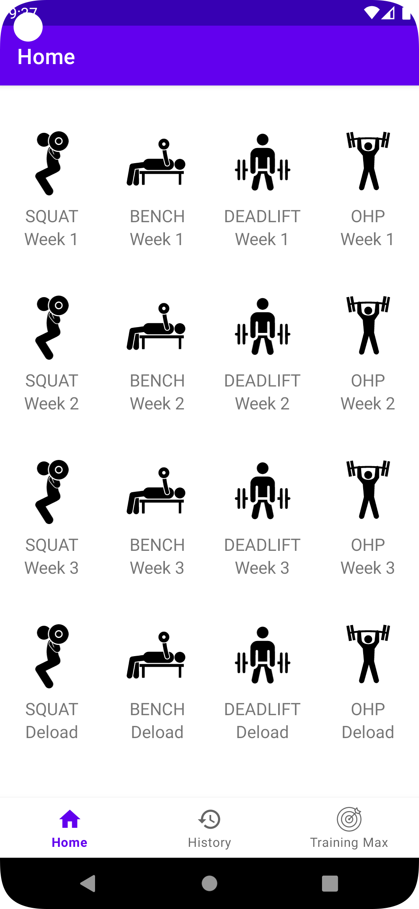
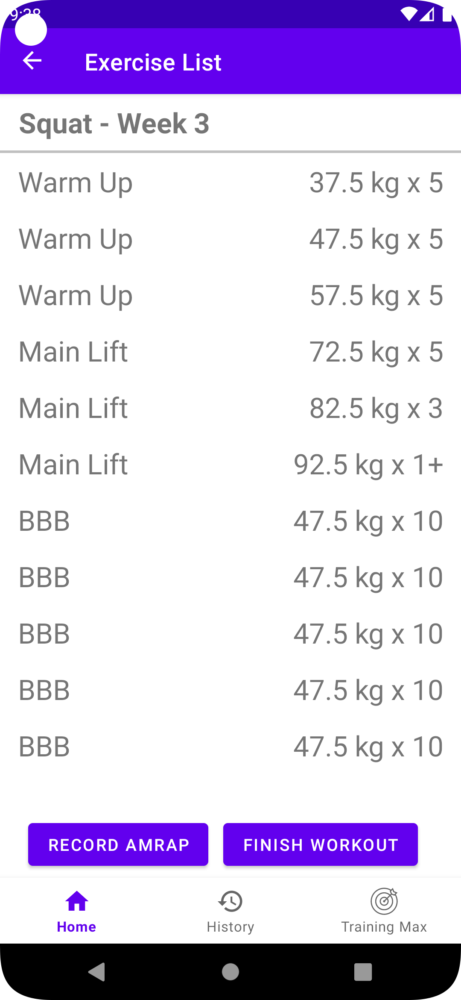
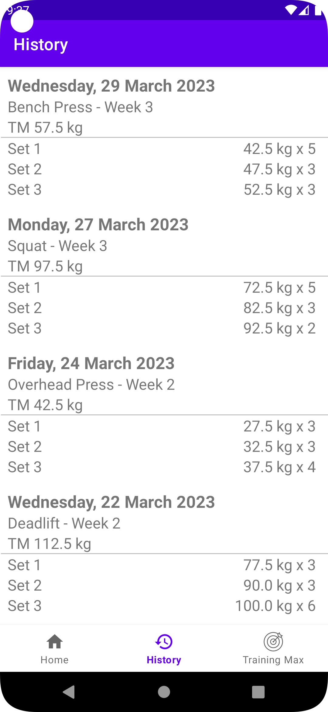

# 5/3/1 Gym App

This is an Android app written in Kotlin designed for gym-goers on the popular 5/3/1 powerlifting program.
The program operates on 4-week cycles and focuses on 4 main compound lifts: the Squat, Bench Press, Deadlift and Overhead Press.
After setting your training maximums in each lift, the app will calculate the weights you should lift on each workout session.
Workout history is saved into a SQLite database, allowing you to track your progress over time.
Upon completion of a cycle, you can auto-increment your training maximums and the app will re-calculate your lifts for the next cycle.

 

